# Plan de Mejoras del Diagrama de Contexto - Proyecto Notiz 🎓🚀

Este documento presenta un análisis y plan de mejoras para el diagrama de contexto del sistema **Notiz (Java Version)**, basándose en la especificación de requisitos del sistema (SRS) del proyecto. El objetivo es corregir discrepancias semánticas detectadas en el diseño actual y alinear el diagrama con las características y el stack tecnológico real del sistema.

---

## 🔍 1. Diagnóstico del Diagrama Actual

Al analizar la imagen proporcionada del diagrama de contexto actual, se han identificado las siguientes observaciones críticas que deben corregirse:

### A. Residuos Semánticos de Otros Sistemas (Errores de Copia y Pega)
Existen etiquetas en los flujos de datos que no corresponden al dominio académico de **Notiz**, sino a una plantilla previa (presumiblemente de un sistema de gestión de ciudadanos de la tercera edad o miembros de un club):
1. **Integración con Google Identity:**
   * **Flujo entrante:** El flujo de `Google Identity` hacia `Notiz` está etiquetado como `"Senior Citizen Information"`.
   * **Flujo saliente:** El flujo de `Notiz` hacia `Google Identity` está etiquetado como `"Senior Citizen's Data Report"`.
   * *Corrección:* Google Identity no gestiona reportes de datos ni información de ciudadanos de la tercera edad en este proyecto. Debe representar la **Solicitud de Autenticación** y el retorno de un **ID Token / Datos de perfil sincronizados (OAuth2 / OIDC)**.
2. **Integración con SendGrid API:**
   * **Flujo entrante:** El flujo de `SendGrid API` hacia `Notiz` está etiquetado como `"Member Copy Of Record"`.
   * **Flujo saliente:** El flujo de `Notiz` hacia `SendGrid API` está etiquetado como `"Senior Citizen's Information"`.
   * *Corrección:* SendGrid es un gateway de correo transaccional. Debe representar el envío de **Datos del mensaje (Destinatario, Plantilla, Datos transaccionales)** desde Notiz, y opcionalmente el **Estado de entrega (HTTP Status)** de regreso.

### B. Omisión de Actores Clave (SRS Sección 2.3)
El documento de descripción del sistema (`2.-Descripcion-General-📃.md`) define formalmente cuatro clases de usuario. Sin embargo, en el diagrama actual solo aparecen tres:
* **Padres / Tutores (ROLE_PARENT):** Está catalogado como un actor indirecto que recibe reportes académicos consolidados vía correo electrónico. Este actor y sus correspondientes flujos están completamente ausentes en el diseño actual.

### C. Simplificación de Flujos de Datos Funcionales
El diagrama actual simplifica en exceso las interacciones de los actores principales, omitiendo flujos clave definidos en la especificación técnica:
* **Profesor:** Solo cuenta con "Datos de Calificaciones" y "Criterios de Evaluación". Se omiten la **Carga Masiva de Notas (XLSX / CSV)** (usando Apache POI, requisito `NZ-013`) y la **Petición de Modificación de Notas** (requisito `NZ-017`).
* **Estudiante:** No se reflejan las interacciones en tiempo real como la **Mensajería Estudiante-Profesor** (requisito `NZ-040`) y las **Alertas Push via WebSockets (STOMP)** (requisito `NZ-018`).
* **Administrador:** Se omite la acción crítica de **Aprobación de Modificación de Notas** (requisito `NZ-017`).

---

## 🛠️ 2. Propuesta de Rediseño del Diagrama de Contexto

El nuevo diagrama de contexto debe delimitar de manera precisa la frontera del sistema **Notiz (Java Version)** con sus 4 actores y sus 2 integraciones de servicios de terceros (SaaS). 

> [!NOTE]
> Las bases de datos (**MongoDB**) y el sistema de caché (**Redis**) se consideran componentes internos de persistencia del backend de Spring Boot, por lo cual, bajo la notación formal de Diagramas de Flujo de Datos (DFD) de Nivel 0 (Contexto), **no** deben dibujarse como entidades externas. Esto mantiene la simplicidad de la frontera del sistema.

### Tabla de Entidades y Flujos de Datos Corregidos

| Entidad Externa (Actor / Sistema) | Tipo | Flujo de Entrada (Hacia el Sistema) | Flujo de Salida (Desde el Sistema) | Requisito Asociado |
| :--- | :--- | :--- | :--- | :--- |
| **Administrador** | Actor | 1. Configuración de periodos, escalas y criterios de evaluación institucional. 2. Gestión global de usuarios. 3. Aprobación/Rechazo de modificación de notas. | 1. Reportes de auditoría inmutables. 2. Visualización global de calificaciones y logs. | `NZ-005`, `NZ-014`, `NZ-017`, `NZ-031`, `NZ-046` |
| **Profesor** | Actor | 1. Carga de calificaciones (Individual / Masiva XLSX/CSV). 2. Solicitud de modificación de calificaciones. 3. Mensajes de chat (STOMP WebSocket). | 1. Listados de alumnos matriculados y horarios. 2. Notificaciones de confirmación de registro. 3. Mensajes de chat (STOMP WebSocket). | `NZ-011`, `NZ-013`, `NZ-015`, `NZ-017`, `NZ-040` |
| **Estudiante** | Actor | 1. Solicitud de consulta de calificaciones. 2. Mensajes de chat (STOMP WebSocket). | 1. Visualización de promedio y reporte académico (PDF/A-1a). 2. Notificaciones en tiempo real de nuevas notas (WebSocket). 3. Mensajes de chat (STOMP WebSocket). | `NZ-012`, `NZ-018`, `NZ-025`, `NZ-040` |
| **Padre / Tutor** | Actor | *(Ninguno - Actor pasivo)* | 1. Recepción de reportes académicos consolidados (vía Email). | `ROLE_PARENT` (Sec. 2.3) |
| **Google Identity Services** | Sistema | 1. ID Token y datos de perfil sincronizados (OAuth2 / OIDC). | 1. Solicitud de inicio de sesión federado. | `NZ-002` |
| **SendGrid API** | Sistema | 1. Confirmación de envío y estado de entrega (HTTP Status). | 1. Datos de notificación de correo (Notas, alertas, 2FA, reportes). | `NZ-004`, `NZ-018`, `NZ-038` |

---

## 📊 3. Diagrama de Contexto en Formato Mermaid

A continuación se presenta la propuesta visual estructurada en **Mermaid**, la cual puedes renderizar en Markdown o importar en herramientas como **draw.io** o **Mermaid Live Editor** para generar tu diagrama final con una estética moderna.

```mermaid
graph TD
    %% Definición del Sistema Central
    Notiz((Notiz: Gestión Académica<br/>Spring Boot & MongoDB))
    
    %% Definición de Actores (Entidades Externas - Humano)
    Admin[Administrador <br/> ROLE_ADMIN]
    Prof[Profesor <br/> ROLE_PROFESSOR]
    Est[Estudiante <br/> ROLE_STUDENT]
    Padre[Padre / Tutor <br/> ROLE_PARENT]
    
    %% Definición de Sistemas Externos (SaaS)
    Google[Google Identity Services <br/> OAuth2 / OIDC Provider]
    SendGrid[SendGrid API <br/> Email Gateway]
    
    %% Flujos con Administrador
    Admin -->|1. Configuración de periodos, escalas y criterios de evaluación| Notiz
    Admin -->|2. Gestión global de usuarios| Notiz
    Admin -->|3. Aprobación de modificación de notas| Notiz
    Notiz -->|4. Reportes de auditoría y logs| Admin
    
    %% Flujos con Profesor
    Prof -->|1. Carga de calificaciones individual / masiva XLSX/CSV| Notiz
    Prof -->|2. Solicitud de modificación de notas| Notiz
    Prof <-->|3. Mensajería instantánea STOMP WebSocket| Notiz
    Notiz -->|4. Listas de alumnos y horarios| Prof
    Notiz -->|5. Notificaciones de confirmación de carga| Prof
    
    %% Flujos con Estudiante
    Est -->|1. Consulta de calificaciones e historial| Notiz
    Est <-->|2. Mensajería instantánea STOMP WebSocket| Notiz
    Notiz -->|3. Reporte académico PDF/A-1a| Est
    Notiz -->|4. Alertas de notas en tiempo real WebSocket| Est
    
    %% Flujos con Padres (Indirecto)
    Notiz -->|1. Reportes consolidados e información de notas| Padre
    
    %% Flujos con Google Identity
    Notiz -->|1. Redirección / Solicitud de autenticación| Google
    Google -->|2. ID Token y datos de perfil sincronizados| Notiz
    
    %% Flujos con SendGrid API
    Notiz -->|1. Petición de envío de email transaccional| SendGrid
    SendGrid -->|2. Estado de entrega HTTP Status| Notiz
    
    %% Estilizado Premium (Aesthetics)
    classDef system fill:#e3f2fd,stroke:#1e88e5,stroke-width:3px,font-weight:bold,color:#0d47a1;
    classDef actor fill:#fff9c4,stroke:#fbc02d,stroke-width:1.5px,color:#f57f17,font-weight:bold;
    classDef service fill:#ffebee,stroke:#e53935,stroke-width:1.5px,color:#b71c1c,font-weight:bold;
    
    class Notiz system;
    class Admin,Prof,Est,Padre actor;
    class Google,SendGrid service;
```

---

## 📋 4. Plan de Acción y Sugerencias de Implementación

Para asegurar que tu diagrama de contexto y la documentación técnica de tu proyecto estén alineados al 100%, te sugiero seguir estos pasos prácticos:

### Paso 1: Actualizar la Herramienta de Modelado
* Abre tu archivo original de modelado (si utilizas Lucidchart, draw.io, Miro, o Canva).
* **Elimina de inmediato** las palabras `"Senior Citizen"` y `"Member Copy of Record"` en las líneas de flujo de SendGrid y Google Identity.
* Modifica los nombres de los flujos de Google Identity para reflejar el proceso **OAuth2 / OIDC** e inyección de token JWT.
* Modifica los nombres de los flujos de SendGrid para reflejar el **Envío de correos transaccionales** (alertas de calificaciones y códigos de recuperación).

### Paso 2: Dibujar al Actor Padres/Tutores
* Añade un nuevo actor `"Padre / Tutor (Indirecto)"`.
* Dibuja un flujo unidireccional que vaya desde el círculo central (`Notiz`) hacia este actor con la etiqueta: **"Reportes consolidados vía correo electrónico"** (esto refleja fielmente la especificación de la sección 2.3).

### Paso 3: Complementar los flujos de Profesores y Estudiantes
* Asegúrate de agregar el flujo bidireccional de **Mensajería instantánea en tiempo real (WebSocket STOMP)** entre Estudiante-Notiz y Profesor-Notiz.
* Agrega en el flujo de entrada del profesor la especificación de **Carga masiva (.xlsx / .csv)** para enriquecer el detalle de la interacción.

### Paso 4: Ajustar la Documentación de Arquitectura de Interfaz Externa
* En tu archivo [`3.-Requisitos-de-la-Interfaz-Externa-🛠️.md`](file:///d:/Escritorio/trabajo/UCC/cuarto/Notiz-Java/3.-Requisitos-de-la-Interfaz-Externa-🛠️.md), asegúrate de que el texto coincida exactamente con las representaciones del diagrama de contexto para evitar cualquier discrepancia durante las revisiones de diseño o entregas de clase.
